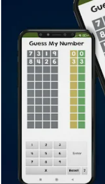

# MY CODE ON DIFFERENT LANGUAGES
### KOTLIN
```kotlin
fun miRemoveAt(a:CharArray, b:Int):CharArray {
   val cutA = CharArray(size = a.size - 1)
   for (i in 0 until b) {
       cutA[i] = a[i]
   }
   for (j in b until a.size - 1) {
       cutA[j] = a[j + 1]
   }
   return cutA
}
fun miAdd(a:CharArray, b:Int, c:Char):CharArray{
       val newA = CharArray(size = a.size+1)
       for (i in 0 until b){
           newA[i] = a[i]
       }
       newA[b] = c
       for (j in b+1 .. a.size){
           newA[j] = a[j-1]
       }


       return newA
}


fun main(){
   var entrada = readlnOrNull()
   while (entrada!=null){
       var teclado = CharArray(0)
       var cursor = 0


      for (i in 0 until entrada.length){
           if (entrada[i] == '-'){
               cursor = 0
           }
           else if (entrada[i] == '+'){
               cursor = entrada.lastIndex
           }
           else if (entrada[i] == '*'){
               cursor++
           }
           else if (entrada[i] == '3'){
               teclado = miRemoveAt(teclado, cursor)
           }
           else{
               teclado = miAdd(teclado,cursor,entrada[i])
               cursor++
           }
       }
       println(teclado)
       entrada = readlnOrNull()
   }
}
```
### PYTHON
```Python
def gcd(a, b):
    """Calculate the Greatest Common Divisor (GCD) using Euclid's algorithm."""
    while b != 0:
        a, b = b, a % b
    return a

def main():
    print("GCD Calculator (Euclid's Algorithm)")
    
    try:
        num1 = int(input("Enter the first number: "))
        num2 = int(input("Enter the second number: "))
        
        result = gcd(abs(num1), abs(num2))  # Use absolute values to handle negatives
        
        print(f"\nThe GCD of {num1} and {num2} is: {result}")
    except ValueError:
        print("Invalid input. Please enter valid integers.")

if __name__ == "__main__":
    main()

```
### C
```C
#include <stdio.h>

int main() {
    int a,b,c, resto, cociente;
    //ENTRADA
    printf("Introduzca el primer número");
    scanf("%d",&a);
    printf("Introduzca el segundo número");
    scanf("%d",&b);
    printf("Introduzca el tercer número");
    scanf("%d",&c);
    //PROCESO
    if(a>b&&b>c) {
        resto= a%c;
        cociente= a/c;
        printf("\t %d dividio |entre %d\n"
               "\t R: %d             C: %d",a,c,resto,cociente);
    }
    else if(a>c&&c>b){
        resto= a%b;
        cociente= a/b;
        printf("\t %d dividio |entre %d\n"
               "\t R: %d             C: %d",a,b,resto,cociente);
    }
    else if(b>c&&c>a){
        resto= b%a;
        cociente= b/a;
        printf("\t %d dividio |entre %d\n"
               "\t R: %d             C: %d",b,a,resto,cociente);
    }
    else if(b>a&&a>c){
        resto= b%c;
        cociente= b/c;
        printf("\t %d dividio |entre %d\n"
               "\t R: %d             C: %d",b,c,resto,cociente);
    }
    else if(c>a&&a>b){
        resto= c%b;
        cociente= c/b;
        printf("\t %d dividio |entre %d\n"
               "\t R: %d             C: %d",c,b,resto,cociente);
    }
    else {
        resto= c%a;
        cociente= c/a;
        printf("\t %d dividio |entre %d\n"
               "\t R: %d             C: %d",c,a,resto,cociente);
    }


    return 0;
}
```

###### A Kotlin CMD Game
[](https://github.com/adriamPaz/PROjects)